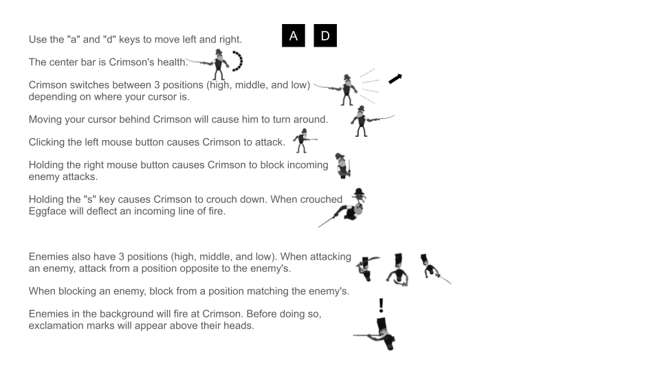

# Cornerfalls Combat

Cornerfalls Combat is a brawler developed using Unity and C#. Engage in thrilling sword fights, mastering the art of parrying and attacking at precise angles. Keep a vigilant eye on the enemies in the background, dodging their projectiles to emerge victorious.

## How To Play



## Getting Started

To experience Cornerfalls Combat, follow these steps:

1. Clone the repository:

   ```bash
   git clone https://github.com/your-username/Cornerfalls-Combat.git
   cd Cornerfalls-Combat
   ```

2. Open the project in Unity.

3. Explore the sword-fighting mechanics and dynamic combat system.

## Future Plans

Cornerfalls Combat serves as a proof of concept, and future projects may expand upon this dynamic combat system. Stay tuned for updates and improvements.